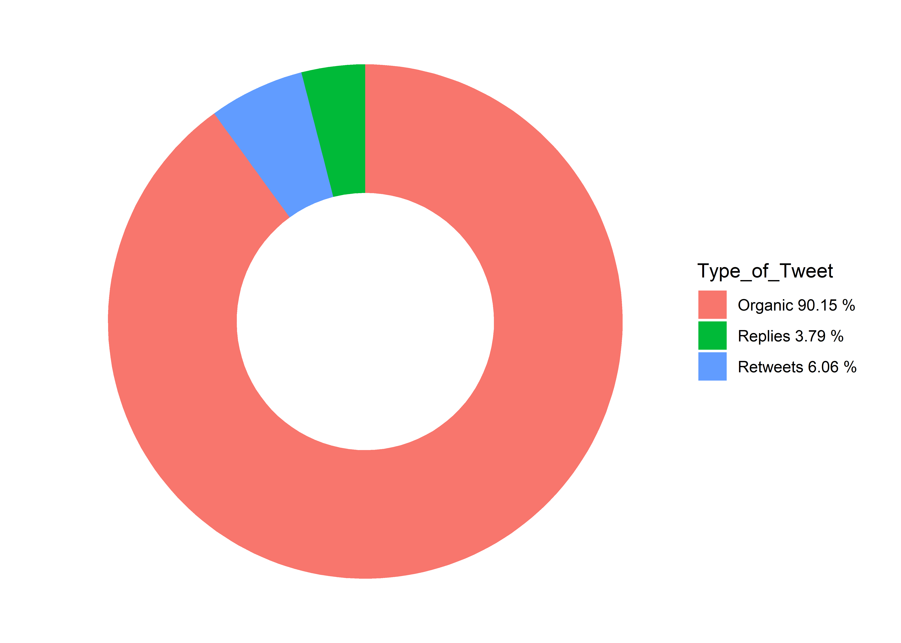
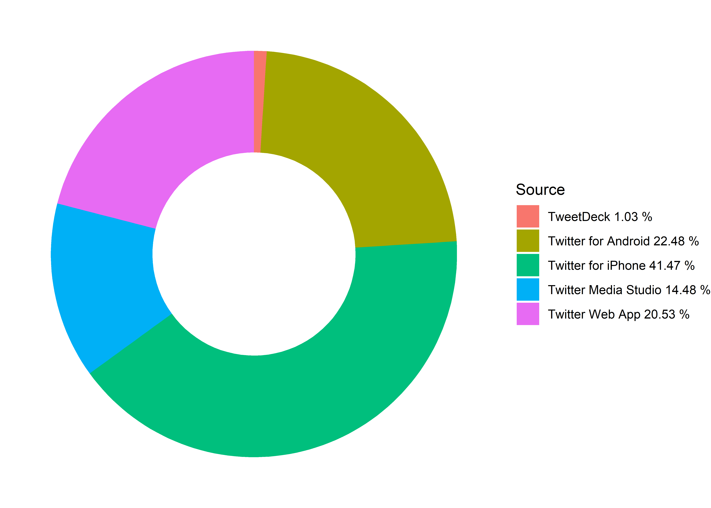
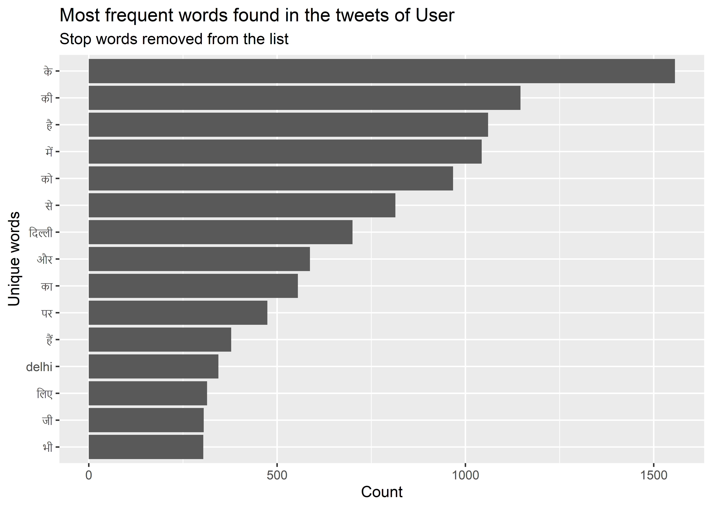

```{r setup, include=FALSE}
knitr::opts_chunk$set(echo = TRUE)
rmarkdown::find_pandoc(version = '2.11.4')
rmarkdown::find_pandoc(dir = "C:/Program Files/RStudio/bin/pandoc")
rmarkdown::find_pandoc(cache = FALSE)
source("Main.r")
```


Subject Name : [`r user_id`](https://www.twitter.com/`r user_id`) 

The Report of *`r user_id`* \n on the basis of Twitter Timeline and Personality Traits are:

## Tweet's Recent Timeline

Timeline refers here for recent time (eg. hours) with comparison to different classes like:
- Favorite Count    
- Retweet Count
- Followers, Friends and status ..

`r timeline`

The above representation shows us the user's recent timeline with respect to their tweets.

## Favorites from `r user_id`'s Timeline

Favorites refers to mutual relationship between user id. Those engage by tweets.

```{r echo=FALSE, warning=FALSE}
users <- get_favorites(user_id, n = 50)
#users <- c(user_id)
#users <- lookup_users(users)
#users

# latest tweet from each user
#tweets_data(users)

library(DT)
datatable(users[, c(3:5)], rownames = FALSE,
          options = list(pageLength = 5))
```

## Composition of Tweets

Tweets has many categories, as present here: 
- Organic Tweets
- Replies
- Retweets





Here Percentages are given to tweet composition.

## Twitter Device 

It is about User's device details, twitter history segregated on the basis of devices:



## Word Frequency 

Word frequency extract the words in increasing order of used words by user in their tweets. 




## Word Cluster

Cluster is based on the references trends and words used by User in the tweets or It shows the engagement of these words in `r user_id`'s timeline. 

```{r , echo=FALSE, message=FALSE, warning=FALSE, fig.show="hold", out.width="100%"}
set.seed(1234)
wordcloud(User_tweets_organic$hashtags, min.freq=5, scale=c(3.5, .5), random.order=FALSE, rot.per=0.35, 
          colors=brewer.pal(8, "Dark2"))
set.seed(1234)
wordcloud(User_retweets$retweet_screen_name, min.freq=3, scale=c(2, .5), random.order=FALSE, rot.per=0.25, 
          colors=brewer.pal(8, "Dark2"))
```

## Personality Analysis

Personal Insight divulge many details about `r user_id`. Personality has different types and behaviors which depends on different studies. 

Here extract insight is a base of the analysed personality graph. It is totally based on Twitter Data. Here classes divides in distinct sentiments like Joy, Anger, Positive, Negative and many more..


```{r echo=FALSE, fig.show='hold', message=FALSE, warning=FALSE, , warning=FALSE}

ggplot(data=sentimentscores,aes(x=sentiment,y=Score))+
  geom_bar(aes(fill=sentiment),stat = "identity")+
  theme(legend.position="none")+
  xlab("Personal Insight")+ylab("Scores")+
  ggtitle("Total sentiment based on scores")+
  theme_minimal()
```


